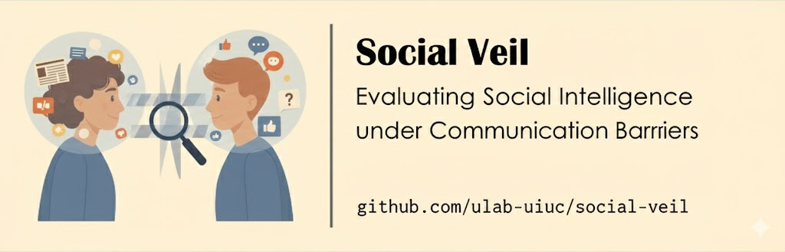

<div style="width: 100%;">
  </img>
</div>


<h1 align="center">SocialVeil: Probing Social Intelligence of Language Agents under Communication Barriers</h1>

<div align="center">

[](https://www.python.org/downloads/)
[](https://opensource.org/licenses/MIT)
[](https://arxiv.org/abs/2602.05115)

</div>

A research framework for evaluating social intelligence in LLM agents through communication barriers.

## 🌟 Introduction

**SocialVeil** is a research framework for evaluating social intelligence in LLM agents through communication barriers. The framework simulates realistic social interactions where agents must navigate various communication barriers:

- 🗣️ **Semantic Barriers**: Ambiguous language and unclear expressions
- 🌍 **Cultural Barriers**: Different communication styles and norms
- 💭 **Emotional Barriers**: Emotional states affecting communication clarity

## 🚀 Quick Start

### Installation

```bash
# Clone the repository
git clone https://github.com/ulab-uiuc/socialveil.git
cd socialveil

# Create environment
conda create -n socialveil python=3.11
conda activate socialveil

# Install dependencies
pip install poetry
poetry install

# Install yq (for config parsing)
pip install yq  # or: brew install yq (macOS)
```

### Configuration

Edit `configs/config.yaml`:

```yaml
models:
  model_a: "gpt-4o-mini"              # Barrier agent
  model_b: "Qwen/Qwen2.5-7B-Instruct" # Partner agent
  vllm_port: 7900
  gpu: "0,1,2,3"

AGENT_OPENAI_API_KEY: "your-key-here"
EVALUATOR_OPENAI_API_KEY: "your-key-here"
```

### Running Experiments

```bash
# Start vLLM server (for local models)
bash scripts/start_vllm_server.sh

# Run evaluation
bash scripts/run.sh

# With custom settings
CONCURRENCY=16 bash scripts/run.sh
PARTNER_REPAIR_MODE=true bash scripts/run.sh
```

### Analyze Results

```bash
python results/compare_modes.py \
    --base_dir results/exp_qwen2.5-7b-instruct_episode_all_neutralized \
    --out_csv results/comparison.csv
```

## 📁 Project Structure

```
socialveil/
├── configs/          # Configuration files
├── data/             # Episode datasets
├── scripts/          # Experiment runners
├── socialveil/       # Core package
│   ├── agent/        # Agent implementations
│   ├── environment/  # Scenario management
│   └── evaluate.py   # Evaluation logic
├── results/          # Experiment outputs
└── analysis/         # Analysis tools
```

## 🛠️ Advanced Usage

### Custom Experiment Settings

```bash
# High concurrency
CONCURRENCY=32 bash scripts/run.sh

# Chain-of-Thought prompting
PARTNER_COT_MODE=true bash scripts/run.sh

# Custom results directory
RESULTS_DIR="results/my_exp" bash scripts/run.sh
```

### Compare Different Evaluators

```bash
CONCURRENCY=32 python analysis/compare_evaluators.py \
    --results_dir results/exp_qwen2.5-7b-instruct_episode_all_neutralized \
    --evaluator1 gpt-4o \
    --evaluator2 qwen2.5-7b-instruct \
    --use_vllm_for_evaluator2 \
    --output results/evaluator_comparison.csv
```

## 📊 Key Features

- ✅ **Multi-Barrier Evaluation**: Test agents across semantic, cultural, and emotional barriers
- ✅ **Flexible Model Support**: OpenAI API or local models via vLLM
- ✅ **High Concurrency**: Parallel scenario execution for faster experiments
- ✅ **Statistical Analysis**: Built-in significance testing and correlation analysis
- ✅ **Extensible Framework**: Easy to add new barrier types or evaluation metrics

## 🔧 Development

### Running Tests

```bash
poetry run pytest
poetry run mypy --config-file pyproject.toml .
```

### Code Style

```bash
# Install pre-commit hooks
pre-commit install

# Run all checks
pre-commit run --all-files
```

## 📝 Citation

If you use this code in your research, please cite:

```bibtex
@inproceedings{socialveil-2026,
  title={SocialVeil: Probing Social Intelligence of Language Agents under Communication Barriers},
  author={Your Name et al.},
  booktitle={International Conference on Learning Representations (ICLR)},
  year={2026}
}
```

## 📄 License

This project is licensed under the MIT License - see the [LICENSE](LICENSE) file for details.

## 🤝 Contributing

Contributions are welcome! Please see [CONTRIBUTING.md](CONTRIBUTING.md) for guidelines.
